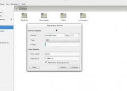

# Dicas de terminal - Trabalhando com SSH

Ultimamente estou desenvolvendo um site pelo qual precisei muito trabalhar com **ssh** para transferir os arquivos. Com isso resolvi instalar o mínimo e necessário de ferramentas **ssh** para o meu **Arch**. Como utilizo o ambiente desktop **Gnome**, também configurei o **Nautilus** para trabalhar entre os arquivos de forma prática e visual. Praticamente instalei apenas duas ferramentas que são: **OpenSSH** que permite trabalhar com o protocolo **ssh** e o **RSSH** que habilita o suporte **SCP (Secure Copy Protocol)** e **SFTP (Security File Transfer Protocol)**. Então mãos a obra!

#### Instalação

Para instalá-los digite em seu terminal:
`sudo pacman -S openssh rssh`
Agora para acessar um repositório remoto via terminal:
`ssh user@domain`

#### Copiando arquivos

Quando desejar copiar algum arquivo remoto para um diretório local, digite:
`scp user@domain:/pasta-remota/arquivo-remoto.txt /pasta-local/arquivo-local.txt`
O mesmo comando só que com parâmetros invertidos, envia os arquivos locais para o repositório remoto:
`scp /pasta-local/arquivo-local.txt user@domain:/pasta-remota/arquivo-remoto.txt`

#### Copiando diretórios

Quando precisar baixar todos os arquivos remotos, digite:
`scp -r user@domain:/pasta-remota/ /pasta-local/`
Para fazer o inverso...
`scp -r /pasta-local/ user@domain:/pasta-remota/`

Com essas dicas você já estará apto para gerenciar arquivos remotos, caso queira mais uma facilidade, no ambiente **Gnome** você pode trabalhar com os arquivos remotos via **Nautilus**. Lembrando que também é possível trabalhar através de um ambiente gráfico concorrentes como o **KDE, XFCE, etc.** 

Para isso abra o **Nautilus** e clique no menu **Arquivos >> Conectar ao servidor**. Informe os dados para conexão **ssh** e se divirtam!!

Fontes:

[NetCommands using SCP and SFTP](http://pangea.stanford.edu/computing/unix/netcommands/scpsftp.php "SCP e SFTP")
[SSH Tricks](http://polishlinux.org/apps/ssh-tricks/ "SSH Tricks")