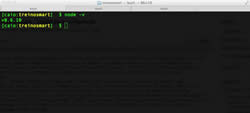
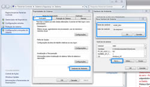

# Node.js para leigos - Instalação e configuração


E neste novo capítulo dessa consagrada série de posts sobre o [mini-cursinho de Node.js para leigos]({{site.url}}/nodejs), hoje o objetivo é passar algumas dicas de como **instalar e configurar um ambiente de desenvolvimento para essa tecnologia**, independente de qual sistema operacional você usa, as dicas serão as mesmas, é claro que, com **procedimentos diferentes (pelo menos no Windows haverá algumas diferenças de configuração, mas nada de grave!).**

#### Instalando Node.js

Primeiro passo, acesse o site oficial: [http://nodejs.org](http://nodejs.org/ "Node.js") e clique em **Download**, para usuários do **Windows e MacOSX**, basta baixar os instaladores dessa página e instalar normalmente. Para quem já utiliza **Linux ou algum Package Manager**, acesse esse link [https://github.com/joyent/node/wiki/Installing-Node.js-via-package-manager](https://github.com/joyent/node/wiki/Installing-Node.js-via-package-manager "Instalando Node.js via Package Manager") que é referente as instruções de como instalá-lo em diferentes distribuições Linux que utilizam **package managers**.

Após o seu download e instalação, caso não ocorra problemas, basta abri o seu **terminal console ou prompt de comando** para digitar o comando: **node -v**

[](../images/node-terminal.jpg "Versão do Node.js instalado")

O mais interessante das **versões atuais (versão 0.6.x) do Node.js** é que ela já vem integrado com [NPM (Node Package Manager)](../npm-node-package-manager "NPM – Node Package Manager") e isso ajudará e muito você na hora integrar módulos de terceiros em seu projeto.

#### Configurando ambiente de desenvolvimento

Para configurar o ambiente de desenvolvimento basta adicionar uma variável de ambiente do sistema operacional, conhecida como **NODE_ENV**, para fazer isso em sistemas **Linux ou MacOS**, basta acessar com um editor de texto qualquer e em **modo super user** o arquivo **.bash_profile ou .bashrc** e adicionar o seguinte comando: **export NODE_ENV='development'**

No Windows, o processo é um pouco diferente, por exemplo, no Windows 7 clique com botão direito no ícone **Meu Computador** e selecione a opção **Propriedades**, no lado esquerdo da janela, clique no link **Configurações avançadas do sistema**. Na janela seguinte, acesse a aba **Avançado** e clique no botão **Variáveis de Ambiente...**, agora no campo **Variáveis do sistema** clique no botão **Novo...**, em **Nome da variável digite NODE_ENV** e em **Valor da variável digite development**. Veja a imagem abaixo para entender melhor:

[](../images/node-windows.jpg "Configuração do Node.js no Windows")

Ao terminar esse procedimento, basta reiniciar o seu computador e começar a brincar com Node.js.

#### Primeira aplicação "Hello World"

Agora iremos desenvolver nossa primeira aplicação Node.js utilizando protocolo HTTP. Para isso basta copiar e colar o código abaixo e no terminal ou prompt de comando execute o comando: **node nome_do_arquivo.js**

``` javascript
 // Carrega a biblioteca HTTP do Node.js.
 var http = require('http');
 // Cria um serviço web para tratar a requisição de resposta da mensagem Hello World.
 var server = http.createServer(function (request, response) {
   // Define os parâmetros de cabeçalho de resposta.
   response.writeHead(200, {'Content-Type': 'text/html'});
   // Escreve uma mensagem de resposta do servidor.
   response.write('<html><body><h1>Hello World</h1></body></html>');
   // Envia uma resposta para o cliente
   response.end();
 });
 // Define a porta e IP que será executado a aplicação.
 server.listen(3000);
 // Imprime mensagem no terminal do servidor.
 console.log('Servidor Node.js em execucao');
``` 

Agora acesse em seu navegador o endereço: **http://localhost:3000** para visualizar a mensagem de Hello World.

Uma outra alternativa de instalação é você **instalar o Node.js via NVM**, para entender como funciona essa ferramenta, leia o post: [NVM (Node Version Manager)]({{site.url}}/nvm-node-version-manager "NVM (Node Version Manager)").

É isso ae pessoal, espero que tenham gostado dessa introdução prática do Node.js, algo que recomendo para vocês estudarem enquanto não sai o novo post é a [Documentação do Node.js](http://nodejs.org/api/all.html "Documentação do Node.js").

Lá você aprenderá a trabalhar com diversas **APIs nativas do Node.js**, que tratam sobre vários aspectos que esta plataforma oferece. [Veja mais posts sobre Node.js]({{site.url}}/nodejs)