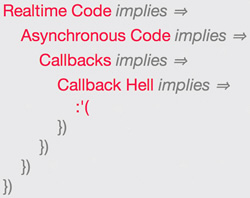

De fato vimos o quanto é vantajoso e performático trabalhar de forma assíncrona, porém em certos momentos, inevitavelmente implementaremos diversas funções assíncronas, que serão encadeadas uma na outra através das suas funções callback. No código a seguir apresentarei um exemplo desse caso, crie um arquivo chamado `callback_hell.js`, implemente e execute o código abaixo:

``` javascript
 var fs = require('fs');
 fs.readdir(__dirname, function(erro, contents) {
   if (erro) { throw erro; }
   contents.forEach(function(file) {
     var path = './' + file;
     fs.stat(path, function(erro, stat) {
       if (erro) { throw erro; }
       if (stat.isFile()) {
         console.log('%s %d bytes',file,stat.size);
       }
     });
   });
 });
``` 

Reparem na quantidade de callbacks encadeados existem em nosso código, detalhe, ele apenas faz uma simples leitura dos arquivos de seu diretório e imprime na tela seu nome e tamanho em bytes. Um pequena tarefa como essa deveria ter menos encadeamentos, concorda? Agora imagine como seria a organização disso para realizar tarefas mas complexas? Praticamente seria um chaos o seu código e totalmente difícil de fazer manutenções.

Por ser assíncrono você perde o controle do que esta executando em troca de ganhos com performance, porém, um detalhe importante sobre assincronismo é que na maioria dos casos os callbacks bem elaborados possuem como parâmetro uma variável de erro. Verique nas documentações sobre sua existência e sempre faça o tratamento deles na execução do seu callback: `if (erro) { throw erro; }`, isso vai impedir a continuação da execução aleatória quando for identificado um erro.

Uma boa prática de código Javascript é criar funções que expressem seu objetivo e de forma isoladas, salvando em variável e passando-as como callback, ao invés de criar funções anônimas, por exemplo, crie um arquivo chamado `callback_heaven.js` com o código abaixo:

``` javascript
 var fs = require('fs');
 var lerDiretorio = function() {
   fs.readdir(__dirname, function(erro, dir) {
     tratar(erro);
     dir.forEach(function(file) {
       ler(file);
     });
   });
 };
 var ler = function(file) {
   var path = './' + file;
   fs.stat(path, function(erro, stat) {
     tratar(erro);
     if (stat.isFile()) {
       console.log('%s %d bytes',file,stat.size);
     }
   });
 };
 var tratar = function(erro) {
   if (erro) { throw erro; }
 };
 lerDiretorio();
``` 

Veja o quanto melhorou a legibilidade do seu código. Dessa forma foi possível reaproveitar a função `tratar(erro)` em dois locais do código, deixamos mais semântico e legível o nome das funções e diminuímos o encadeamento de callback das funções assíncronas. A boa prática é ter o bom senso de manter no máximo até dois encadeamentos de callbacks, ao passar disso significa que esta na hora de criar uma nova função fora externa para ser chamada no último callback, ao invés de continuar criando um **callback hell** em seu código.

Fonte: [Aplicações web real-time com Node.js](https://casadocodigo.refersion.com/l/630.1389 "Aplicações web real-time com Node.js")