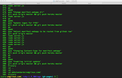

# Dicas de terminal - Histórico de comandos


Para quem trabalha com terminal, digitando diversos comandos com frequência vira e volta acaba digitando comandos pelo qual num futuro próximo vai utilizá-lo, porém acaba esquecendo de como chamá-lo.
Para este caso existe o comando: ``` bash
 history
``` 
[](../images/terminal-comando-history.jpg)

[](../images/terminal-comando-history.jpg)
Ele simplesmente lista todos os comandos que foram executados.
Com isso fica mais fácil de lembrar qual foi o comando magia negra você fez no terminal recentemente.

Outra dica é filtrar a lista de histórico, geralmente se faz isso quando se lembra parcialmente sobre o comando digitado, para isso utilize `| grep 'comando'`, veja abaixo um exemplo que filtrando todos os comandos que usei `sudo`:

``` bash
 history | grep sudo
``` 

Veja também outras [dicas de terminal](../dicas-de-terminal "Dicas de terminal").