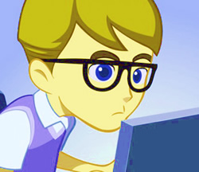

Esse é um post de dicas simples de se fazer que vão exigir de você apenas algumas mudanças de hábito que visa trazer como resultado, mais produtividade em seu dia-a-dia de programador.
Espero que gostem e se você já pratica algumas dessas dicas ou quer recomendar algum bom hábito não citado aqui comente no final do post!

### Use mais o teclado

Na minha opinião o mouse é um device para usuários e não para desenvolvedores. Digo isso porque para se obter produtividade em suas ferramentas de desenvolvimento, o melhor a se fazer é dominar os principais comandos do teclado. Toda ferramenta possui uma lista imensa de combinações de teclas que realizam alguma tarefa útil de forma mais rápida do que perdendo tempo ao movimentar o mouse a procura de uma ação para no final fazer um "click" ou "double-click". Basta decorar os principais comandos ou pelo menos os que você usa com frequência. No final você será mais veloz no teclado, capaz de executar suas tarefas em menor tempo do que usando um mouse.

### Automatize tarefas

Essa dica vale a pena botar em prática! Afinal, se você sabe programar, então você deve automatizar suas tarefas repetidas do dia-a-dia. Seja mais preguiçoso! Automatize tudo que puder! Além de programar em seus projetos, programe também as tarefas que você realiza com frequência. Quando perceber que está fazendo "tarefas de robô", reserve um tempo para automatizá-la. Assim no futuro vai sobrar tempo pra tomar um cafézinho vendo as novidades do Facebook ou Twitter enquanto o computador faz todo trabalho para você.

### Domine a tela preta

Não importa se você usa Linux, Mac ou Windows, todo sistema operacional tem a famosa tela preta (mais conhecida por terminal no Linux/Unix/Mac e prompt de comando no Windows). É lá que toda magia de baixo nível se pode fazer, como por exemplo, levantar um servidor web, compilar uma aplicação, abrir qualquer programa sem usar o mouse (isso mesmo dominar a tela preta resulta também em dominar mais o teclado), automatizar tarefas (é neste ambiente que se realiza a dica anterior sobre automatizar tarefas) e muito mais. A base de todo sistema operacional é a tela preta, e aprender seus princípios vai ampliar seus conhecimentos sobre como funciona um sistema operacional e consequentemente vai te ajudar a identificar problemas e soluções de baixo nível relacionados em seus projetos de forma mais assertiva.

### Mantenha seu sistema operacional rápido

Parece dica de técnico de informática, mas manter seu sistema operacional limpo e atualizado é o mínimo que todo usuário deve fazer. Afinal, isso só vai garantir que seu sistema funcione sem gargalos, e ter esse bom hábito vai te proteger contra dores de cabeça inesperada. Para isso basta limpar seu sistema desinstalando programas inúteis ou pelo menos desativando a inicialização automática deles (que ocorre quando você liga o pc), atualizar sempre o sistema operacional e suas ferramentas.

### Saiba mais sobre redes

Estudar pelo menos o básico de redes é o mínimo que todo desenvolvedor deve fazer. Um bom domínio sobre redes só vai te trazer benefícios sobre como desenvolver suas aplicações de forma eficiente e otimizada. Por isso se pretende estudar redes, recomendo que estude o funcionamento básico dos principais protocolos que são utilizados extensivamente em uma aplicação: **HTTP, HTTPS, TCP, DNS, SSH, IP.**

### Explore novas ferramentas

Sempre que puder instale e teste novas ferramentas ou frameworks. Nunca se acomode em usar sempre as mesmas coisas, pois frequentemente surgem novidades que visam facilitar sua vida e seus projetos, resultando em melhorar sua produtividade e ficar fora das novidades só vai te deixar para trás.

### Aprenda uma nova linguagem de programação

Que tal aprender uma nova linguagem de programação? Os benefícios são altos! Você não precisa se tornar especialista em uma linguagem, apenas aprenda as principais utilidades de uma nova linguagem e principalmente seus paradigmas. Aprender novos paradigmas de programação vale a pena, além de você expandir seu knowhow, você terá facilidade em resolver problemas aplicando uma boa solução através de um paradigma adequado para um determinado projeto. Outro benefício de ser aprender uma tecnologia nova é que você abrirá portas para novas oportunidades de trabalho principalmente se você tiver domínio sobre tecnologias de maior uso pelas empresas e startups.