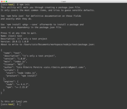

# Customizando npm init


Para quem não conhece esse comando, o `npm init` apresenta um simples questionário para descrever informações básica de um módulo Node.js, pelo qual seu resultado final é gerar o arquivo `package.json`.

Porém, é possível customizar o resultado desse comando, incrementando novas informações para agilizar na geração do `package.json` a cada novo projeto. Para fazer essa simples customização, basta criar na pasta raíz de usuário do sistema o arquivo: `~/.npm-init.js`, nele você pode injetar valores pré-definidos para alguns campos chaves na geração de um `package.json`, veja esse exemplo:

``` javascript
 exports.name = prompt('Name', basename);
 exports.description = prompt('Description', '');
 exports.version = prompt('Version', config.get('init-version'));
 exports.main = config.get('main-file');
 exports.license = config.get('init-license');
 exports.author = config.get('init-author-name') + '<'+config.get('init-author-email')+'>';
 exports.scripts = {
   start: 'node ' + config.get('main-file'),
   prestart: 'npm install'
 };
 exports.engines = {
   node: '>= 4.4.7',
   npm: '>= 2.15.8'
 };
``` 

Cada `exports.chave` é referente a um atributo a ser incluído no `package.json`.
Outro detalhe mais legal, é que é possível deixar algumas das principais perguntas já respondidas com valores default, para isso basta editar o arquivo `~/.npmrc`, incluindo nele algums campos, como por exemplo:

``` bash
 init-license='MIT'
 init-author-name='Caio Ribeiro Pereira'
 init-author-email='caio.ribeiro.pereira@gmail.com'
 init-version='0.0.1'
 main-file='index.js'
``` 

Com isso, praticamente você nem terá mais que responder as principais perguntas, pois elas já serão pré-definidas pelos valores existentes no `~/.npmrc`, tanto é que elas são acessadas magicamente pela função `config.get('nome-de-uma-key')`.

Agora se você criar um novo projeto e rodar o comando `npm init` você terá um resultado semelhante a este:

[](../images/npm-init.png)

See you in the next post!